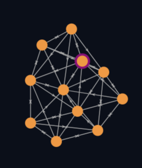
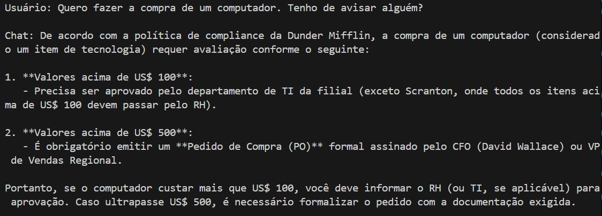

# Ponderada: "Desafio: A Auditoria do Toby"

&emsp; Este repositório é a resposta do trio Cecília, Laura e Lucas do Instituto de Tecnologia e Liderança da T12-EC08 à ponderada "Desafio: A Auditoria do Toby". Este implementa um chatbot com 4 níveis de complexidade:

1. RAG que consome a política de compliance da empresa fícticia Dunder Mifflin e responde dúvidas sobre a política.
2. Script que vasculha o _dump de emails_ da empresa e verifica se Michael Scott está conspirando contra Toby.
3. Script que verifica quebras de compliance. Existem dois tipos de quebras: 
    1. Transações que, por si só, quebram as regras de compliance. Para essas, criamos um agente que verifica as transações na planilha e validam-nas de acordo com as regras descritas na política de compliance. 
    2. Transações que precisam de contexto de comunicação para descobrir a fraude (e.g. funcionários combinando desvios de verba). Para isso, criamos um sistema capaz de verificar os emails e identificar as transações fraudulentas.

&emsp; Abaixo você observar o que é cada seção individualmente e como rodá-la.

## RAG com dúvidas da política de compliance

&emsp; O RAG (Retrieval Augmented-Generation) é feito a partir do seguinte fluxo: Load -> Sanitizing -> Chunking -> Embedding & Storing. Essa seção do projeto está contemplada no arquivo ``src/parte-1-rag/rag/rag_politica_complicance.py``. No entanto, todos os arquivos da pasta ``src/parte-1-rag`` contribuem para tal. Abaixo, explica-se como o RAG foi feito para o `politica_compliance.txt` em vias de criar um chatbot que responde dúvidas acerca da política da empresa.

&emsp; Para começar o RAG, foi necessário carregar o `politica_compliance.txt`. Como o documento estava localmente conosco (na pasta `documents`), cumprir este passo foi simples: bastou carregá-lo em uma variável usando as funções `open()` e `read()` nativas do Python. 

&emsp; Em seguida, criou-se os chunks. Primeiro, pensou-se em utilizar a biblioteca **LangChain** para quebrar o texto com base no número de tokens. No entanto, como o documento é semanticamente estruturado em seções, optou-se por um _chunking_ manual. Para tanto, definimos e utilizamos a função `create_chunks()` e sua auxiliar `include_header()`. Essas, em conjunto, quebram o texto com base na separação que o próprio faz de suas seções, utilizando o "==...==" para iniciá-las e terminá-las. Ao final, utilizou-se a **LangChain** para deixar os _chunks_ em formato adequado para passarem pelo embedding (função ``create_documents``).

&emsp; Por último, fez-se o _embedding_ e _storing_ dos _chunks_. Para tanto, usou-se o modelo de embedding `gemini-embedding-001` e a Vector Store do Qdrant. Isso está mais claramente definido no arquivo ``qdrant_vector_store.py`` dentro de ``src/parte-1-rag/rag/vector_store``, onde definimos a classe VectorStore, inicializando o cliente e a coleção "ponderada-parte-1" no Qdrant com o embedding supracitado. Essa classe também disponibiliza os métodos `add_documents` e `similarity_search` do QdrantVectorStore. Então, no arquivo ``rag_politica_compliance.py``, carregamos os chunks na Qdrant usando `add_documents`.

&emsp; Abaixo, pode-se verificar o grafo pelo embedding.

<div style="align: center;">
<sup>Figura 1: Grafo com nós de chunks</sup>



<sub>Fonte: os autores</sub>

</div>

&emsp; Em `src/parte-1-rag/test.py`, inicializa-se um agente da NVIDIA com acesso a essa tool que responde dúvidas do cliente no terminal, enquanto mantém o histórico da conversa.

<div style="align: center;">
<sup>Figura 1: Grafo com nós de chunks</sup>



<sub>Fonte: os autores</sub>
</div>

## Módulo de Auditoria e Dados

 Preparação e Limpeza de Dados, Detecção de Fraudes por Regras (Nível 3.1) e Desenvolvimento de Ferramentas (Tools) para Agentes de IA.

---

### 1. Estrutura e Arquitetura do Módulo

Toda a lógica foi encapsulada no pacote `src/auditoria` para garantir modularidade e evitar conflitos de dependências (como os erros de `ImportError` e `NameError` já resolvidos).

| Caminho | Tipo | Propósito |
| :--- | :--- | :--- |
| `src/auditoria/` | **Pacote** | Contém toda a lógica de dados e regras. |
| `src/auditoria/data_preparation.py` | Script | **Responsável pela entrada de dados (I/O).** Carrega o CSV, limpa, padroniza e garante IDs únicos. |
| `src/auditoria/auditor_rules.py` | Script | **Responsável pela lógica de negócios.** Implementa as regras de compliance (Nível 3.1) e desenvolve as Tools. |
| `src/auditoria/main_orchestrator.py` | Script | **Ponto de Execução e Teste.** Orquestra o fluxo de trabalho para validação e demonstração. |


---

### 2. Nível de Entrega: Detecção de Fraudes (Nível 3.1)

O módulo implementa o primeiro nível de detecção, focado em violações diretas da política de compliance (`politica_compliance.txt`).

#### 2.1. Função Principal de Validação

| Função | Descrição |
| :--- | :--- |
| `executar_auditoria_simples()` | Função mestra que gerencia o fluxo de trabalho: carrega os dados brutos, limpa-os e aplica todas as regras de compliance, retornando um DataFrame apenas com as transações violadas e suas justificativas. |

#### 2.2. Regras Implementadas (Extraídas da Política)

As seguintes regras são verificadas linha por linha no DataFrame:

| ID da Regra | Tipo | Condição | Ação |
| :--- | :--- | :--- | :--- |
| **R001\_LIMITE\_ALTO** | Limite de Gasto | `valor` > $500.00 | Sinaliza transações que exigem aprovação do CFO. |
| **R003\_RESTRITO\_LOCAL** | Gasto Proibido | `descricao` contém "Hooters" | Viola a política de locais de reembolso. |
| **R004\_PROIBIDO\_ITENS** | Itens Proibidos | `descricao` contém palavras-chave (ex: "algemas", "espada", "frigobar", "spa") | Sinaliza compras estritamente proibidas ou não reembolsáveis. |

---

### 3. Entregas Críticas para o Agente de IA (Pessoa 3)

A peça mais importante para a integração com a Cecilia é a Ferramanta de Acesso aos dados. 

### 3.1. Ferramenta de Busca de Transação (Tool)

| Função | Finalidade | Módulo |
| :--- | :--- | :--- |
| `ferramenta_busca_transacao_id(id_transacao)` | Permite que o **Agente de IA** (LLM) pesquise qualquer ID de transação mencionado em um e-mail. Retorna todos os detalhes da transação em formato **JSON**. | `auditor_rules.py` |

**Integração:** A Tool utiliza a variável global interna (`df_transacoes_global`) que é preenchida por `executar_auditoria_simples()`. Isso permite que a Tool seja chamada pelo Agente (que só passa o ID) e ainda acesse o DataFrame limpo.

### 3.2. Estrutura de Dados (Nível 3.2)

O módulo `auditor_rules.py` também inclui a função **`detectar_smurfing()`** (fraude por estruturação) que será utilizada no Nível 3.2 para analisar padrões de gasto divididos pelo mesmo funcionário/fornecedor/data, antecipando a lógica de Fraude Contextual.

## Rodando a aplicação com Docker

# Como rodar a aplicação

&emsp; Para buildar a aplicação a partir do docker file use o comando:

```bash

docker build -t chatbot:latest .

```

&emsp; Então, para rodar a aplicação e alterar os arquivos, use:

```bash

docker run -it --rm -v $(pwd):/usr/src/chatbot chatbot:latest /bin/bash

```

&emsp; Isso linkará os arquivos no seu diretório atual com os arquivos da imagem. Além disso, abrirá um bash em que você pode rodar comandos nos arquivos da imagem.
&emsp; Após as alterações, rode o comando:

```bash

pip freeze > requirements.txt && \
exit

```

&emsp; E commite.